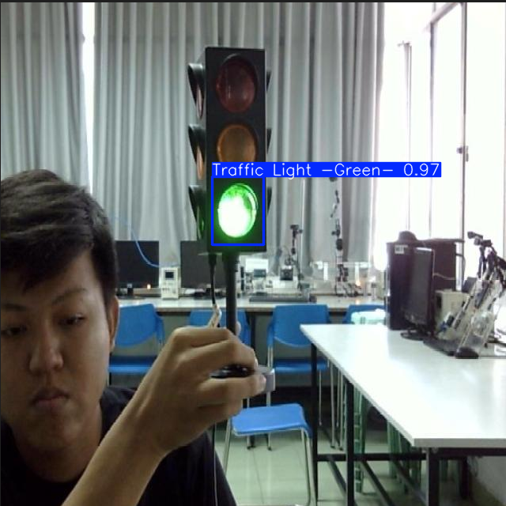

# Traffic-Sign-Detection using YOLO
A deep learning model for detecting and classifying traffic lights using YOLOv11 model, with a FastAPI implementation for real-time predictions.

## Setup intructions

### 1. Clone the repository
```
git clone https://github.com/ArjunKadivar/Traffic-Sign-Detection.git
```

### 2. Install dependencies
```
pip install -r requirements.txt
```

### 3. Download the trained model
- Place the `best.pt` file in the project root directory.

## Running the API

### 1. Start the FastAPI server
```
uvicorn api:app --reload
```
### 2. API Endpoint
- POST /predict: Submit an image for traffic light detection

### 3. Testing the API
- Visit http://localhost:8000/docs for interactive API documentation.
- Use the Swagger UI to test endpoint.
- Send POST requests with images to get predictions.

### API response Format
```
{
    "predictions": [
        {
            "x1": 10.50,
            "y1": 20.30,
            "x2": 100.70,
            "y2": 200.40,
            "confidence": 0.85,
            "class_id": 1,
            "class_name": "Traffic Light -Red-"
        }
    ]
}
```
You can also test the api using curl command. Here's the correct curl command to test an API:
```
curl -X POST "http://127.0.0.1:8000/predict" -H "accept: application/json" -H "Content-Type: multipart/form-data" -F "file=@/path/to/your/image.jpg"
```

Replace `/path/to/your/image.jpg` with the actual path to your test image.

## Model details

- Base Architecture: YOLOv11(YOLO11n)
- Classes: 4 (Traffic Light: Green, Red, Yellow, Off)
- Input Size: 640x640
- Training Epochs: 100
- Batch Size: 16

## Performance Metrics

- mAP50-95: 0.46
- Per-class Performance(Precision, Recall):
  - Green Light: (1.00, 0.60)
  - Red Light: (1.00, 0.00)
  - Yellow Light: (0.95, 0.77)
  - Off Light: (0.90, 1.00)

## Setup to run google colab notebook

- Keep the dataset in your google drive. Take the dataset from here: [https://drive.google.com/file/d/1zKNIAcOa_6R_EfOMDwsLsYWilVdu2RO_](https://drive.google.com/file/d/1zKNIAcOa_6R_EfOMDwsLsYWilVdu2RO_) 
- Make sure that the structure of the data should be as same as below:
```
/content/dataset/
├── images/
│   ├── test/    # test images
│   ├── train/   # Training images
│   ├── val/     # Validation images
├── labels/
│   ├── test/    # test images
│   ├── train/   # Annotations for training images
│   ├── val/     # Annotations for validation images
data.yaml         # The dataset configuration file
```
### Testing with image

- While testing in `test.py ` with random image, getting the below output:

